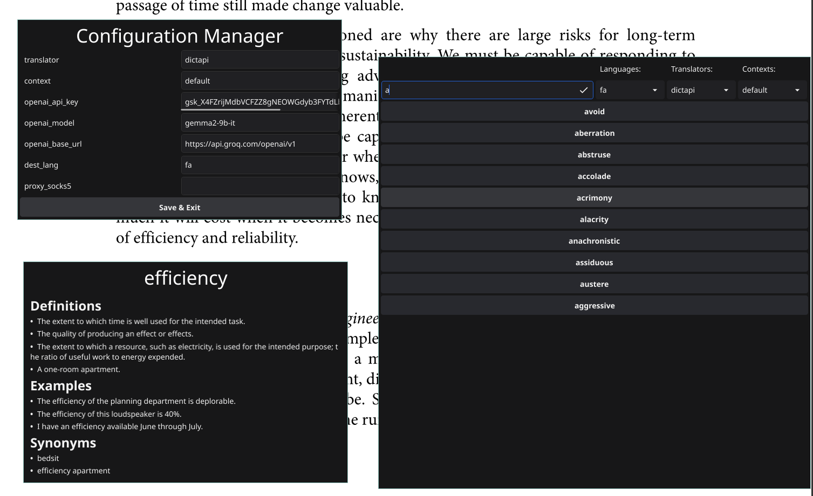

# First Thoughts About This App

**Integrated Flash Card** is a tool for memorizing English words on your Unix system.  
Whenever I encounter a new English word in a PDF book or on a manpage, I copy it,  
look up the translation in Google Translate, and write it on physical flashcards to practice.  
But I imagined a better design and solution. **iflashc** is exactly what I wanted—an integrated  
tool that translates words and expands your vocabulary library.

# iflashc

Using this app is definitely simpler than explaining it:  
- Create a shortcut for the app on your desktop.  
- Select arbitrary text on your desktop and press the defined key.  
- Boom! See the meaning, definition, examples, and synonyms of the selected word.  

You can configure the translator, destination language, OpenAI token and base URL, context, and even a proxy.  

**iflash** caches everything. You can set a context for saved words in a specific cycle  
and then practice them through a generated library/dictionary.  

# Install or update

## Download Binary  
```bash
sudo wget "https://github.com/alirezaarzehgar/iflashc/releases/latest/download/iflashc" -O /bin/iflashc
sudo chmod +x /bin/iflashc
```

## Compile from source

```bash
make
sudo make install
```

## Using `go install`

```bash
go install github.com/alirezaarzehgar/iflashc@latest
```

## Usage

You can run `iflashc` on terminal. But it's not the correct usage of this application.
Set shortcut on your faivorite desktop/window manager and enjoy.

```plaintext
$ iflashc --help
translate selected text

Usage:
  iflashc [flags]
  iflashc [command]

Available Commands:
  completion  Generate the autocompletion script for the specified shell
  config      manage configs
  dictionary  visit dictionary
  help        Help about any command

Flags:
      --db string   local database path (default "/home/ali/.iflashc.db")
  -h, --help        help for iflashc
  -t, --toggle      Help message for toggle

Use "iflashc [command] --help" for more information about a command.
```

# Configuration
## Config i3
You can bind these subcommands to any key in i3 or other window managers/desktop environments.
Save following configurations on your `i3` config file on `~/.config/i3/config`.

### Set mode

After this config you can press `mod+p` and use app just by pressing f,c,d keys.
If `mod+p` was predefined, change it with your key binding.

```plaintext
set $iflashc Integrated Flashcards: (f) Find meaning, (c) Change Configs, (d) Dictionary
bindsym $mod+p mode "$iflashc"
mode "$iflashc" {
	bindsym f exec iflashc
	bindsym c exec iflashc config
	bindsym d exec iflashc dictionary

  bindsym Escape mode "default"
}
```

### Bind each subcommand
Change `bindcode` numbers based on your needs. Use `xev` to find key codes.

```plaintext
bindsym $mod+Shift+f exec iflashc
bindsym $mod+Shift+c exec iflashc config
bindsym $mod+Shift+d exec iflashc dictionary
```

### Bind f10-12 using bindcode
Change `bindcode` numbers based on your needs. Use `xev` to find key codes.

```plaintext
bindcode 96 exec iflashc            # f12
bindcode 95 exec iflashc config     # f11
bindcode 76 exec iflashc dictionary # f10
```
